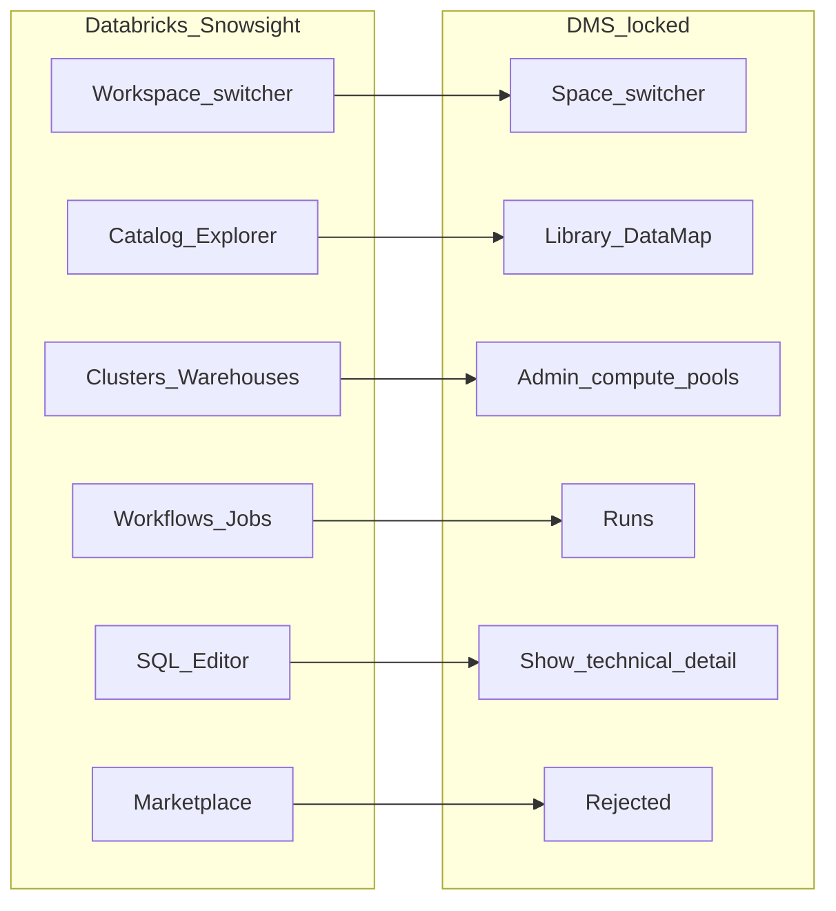

# DMS UI — long-term plan (Spaces product, not a Databricks clone)

## Verdict from research


| Source of truth                                                           | Implication                                                                                                                                                       |
| ------------------------------------------------------------------------- | ----------------------------------------------------------------------------------------------------------------------------------------------------------------- |
| [DMS_TECHNICAL_ARCHITECTURE.md](DMS_TECHNICAL_ARCHITECTURE.md) §9–10, §14 | Ten surfaces, Vite+React+TS, docked source panel, every number clickable; **Marketplace / Spark / Trino / fat desktop / bidirectional Excel explicitly rejected** |
| [docs/SPACES.md](docs/SPACES.md)                                          | Left rail = Spaces+Library; center = chat; right = sources / SQL / proposal diff / audit chip                                                                     |
| [CLAUDE.md](CLAUDE.md)                                                    | No CortexOS import; Excel source-only; five ports; DuckDB only in `packages/executor`; gate via Cortex HTTP                                                       |
| Pre-T0 UI (`archive/pre-t0` → `apps-web`)                                 | Next.js shell with 9 nav labels (QUERY, WAREHOUSE, BRAIN, SKILLS…) — useful chrome patterns, **wrong IA** vs locked product                                       |
| Current [apps/ui](apps/ui)                                                | T0 stub only (`package.json` echo scripts) — **full rebuild required**                                                                                            |
| T1 (`81d0d77`)                                                            | Postgres control plane ready; **no product API routes yet** — UI must start fixture-first                                                                         |


**Do not assemble** MinIO/Spark/Trino/Unity/Superset/Jupyter as the DMS UI path. Those belong later (if ever) behind existing ports at scale (§13 stage 5–7). Lakehouse-at-home is a learning reference, not the product.

**Dashboard / PowerBI:** out of D1. Architecture’s differentiator is clickable provenance + amend confirm, not BI embeds. Later: generated export / optional “Open in Power BI” deep-link from certified gold metrics — never a Power BI clone inside DMS.

---

## Metaphor map (enterprise UI → DMS)




| Enterprise control          | DMS equivalent                                   | Notes                                        |
| --------------------------- | ------------------------------------------------ | -------------------------------------------- |
| Hamburger / collapse rail   | Collapse left rail                               | Keep                                         |
| Global search               | Search Spaces, sources, proposals, audit entries | Fixture → later `/sources` + FTS             |
| Assistant icon              | Chat is primary, not a side gadget               | No second “Genie” product                    |
| Workspace / tenant switcher | **Space ▾** + tenant (admin)                     | Space is the sandbox                         |
| + New                       | New Space · Upload source · New amend proposal   | Not notebooks/pipelines zoo                  |
| Catalog                     | **Library** + Data Map                           | Governance = ACL + manifest, not Unity clone |
| Compute                     | **Admin → Pools**                                | DuckDB lanes; never Spark clusters           |
| Workflows                   | **Runs**                                         | Ingest / promote / sync / apply              |
| SQL / ML / Marketplace      | Rejected or demoted                              | SQL under ⟨show technical detail⟩            |


---

## Gap vs previous demo

Research: [Explore archived pre-t0 UI](7602594f-bd7e-4b7b-ad01-19c184b3d6e2), [Map architecture to UI surfaces](278ab32f-c373-4d05-91f5-55bd9fc1e94d).

**Had:** AppShell, Sidebar, TopBar, RoleSwitcher, ResultGrid/Chart, SqlBlock; 9 routes; Query (`/`) richest (thread + SQL/plan/grid/audit); Spaces 3-column; Studio Catalog/Ingest/Pipelines; Audit log; API offline banner. Dark `cx-`* tokens in `globals.css` (Inter + green accent — **do not carry Inter/neon-green wholesale**; rebuild light appliance look per design rules).

**Lacked:** Global search, tenant/Space chrome in top bar, +New, Library route, unified Catalog, compute pools UI, Runs/workflows, SQL editor, unified proposal/diff confirm, docked source panel as product default, clickable-number → preview spine, suggested questions / §10 rules.

**Wrong / drop from nav:** QUERY vs CHAT split, WAREHOUSE, BRAIN, SKILLS as customer peers; Next App Router (architecture mandates Vite SPA, no SSR); Brain’s orphan Tailwind classes; fragmented amend (grid propose + data approve + gate banners).

**Highest-value salvage (patterns only):**

1. Query interaction model → Central chat + right context
2. Spaces page structure → Space switcher + scoped ask + sources
3. Studio tabs → Studio surface
4. ResultGrid propose / Data approve → seed Amend confirm UX
5. RoleSwitcher / offline banner / health poll → role chip + API banner

---

## Target IA (locked)

```
Top:  netie | [Space ▾] | search | role chip | user ▾
Left: Chat · Library · Studio · Amend · Audit · Runs · Admin
Center: surface body (Chat default)
Right: SOURCES panel (docked; never modal over answer)
```

Badge copy locked (do not soften): L0/L1 green certified|governed · L2 amber check-sources|unusual · ABSTAIN grey.

---

## Phased delivery (long-term goal)


| Phase  | ID             | Delivers                                                                                                                 | Unblocks                                              | Blocked by        |
| ------ | -------------- | ------------------------------------------------------------------------------------------------------------------------ | ----------------------------------------------------- | ----------------- |
| **U0** | Shell          | Vite+React+TS+Tailwind; top bar + left rail + docked SourcePanel; fixture chat with 6 suggestions + clickable `values[]` | Product shape                                         | None              |
| **U1** | Provenance     | Source cards by contribution %; virtualized preview grid; four-clicks-to-bedrock                                         | **Thesis differentiator — prioritize right after U0** | Fixture → T7 APIs |
| **U2** | Spaces+Library | Space switcher live; Library + Data Map; scope chip wired                                                                | Scoped ask                                            | T3 or fixtures    |
| **U3** | Studio+Runs    | Drop zone + ingest receipt; Runs timeline                                                                                | Ingest demo                                           | Worker/runs       |
| **U4** | Amend+Audit    | Plain-language diff; confirm/revise; stale token 409; Audit verify                                                       | Dual-confirm                                          | T4 + F5/ledger    |
| **U5** | Admin          | Users/roles/departments/ACL/pools                                                                                        | Appliance ops                                         | T1 tables exist   |
| **U6** | Hardening      | OIDC; SSE reconnect; e2e §10                                                                                             | D1                                                    | T5/T6             |


Backend stays on T2–T7…. UI talks only to DMS API. U0–U1 fixture-first so work does not wait on R1.

---

## Claude Code verification gate (before/while U0)

Handoff checklist for Claude Code against [CLAUDE.md](CLAUDE.md):

1. Confirm stack is **Vite SPA**, not Next (architecture §9).
2. Confirm nav items ⊆ {Chat, Library, Studio, Amend, Audit, Runs, Admin} + Space switcher — no Marketplace/Compute-clusters/ML.
3. Confirm no new port/abstraction; UI depends only on DMS HTTP.
4. Confirm Excel remains source-only (preview/download/export — no write-back).
5. Confirm amend UI will call `compliance_gate` path via API mutations later (no local policy in UI).
6. Confirm `ledger_ref` display = Cortex pointers only.
7. Mark any PR that invents Spark/Trino/Superset as **out of scope**.

---

## Immediate execution after plan approval: U0

**Chosen default:** U0 chrome + fixtures now (no new FastAPI routes in this slice). Thin Spaces APIs wait for a later T3-aligned slice.

Concrete work in [apps/ui](apps/ui):

1. Scaffold Vite + React 19 + TypeScript + Tailwind (expressive fonts; avoid Inter/purple-gradient clichés; light appliance aesthetic).
2. Layout components: `AppShell`, `TopBar` (Space switcher, search stub, user menu), `LeftNav`, `SourcePanel` (docked).
3. Routes for all ten surfaces as **empty-or-fixture pages** so nav never 404s; Chat is the default landing with six suggested questions.
4. Fixture answer envelope matching architecture §4.7 shape (clickable `values[]`, badges, contributing_sources) — Source panel reads fixtures.
5. Port useful interaction ideas from archive (ResultGrid pattern, RoleSwitcher → role chip) without copying wrong nav labels.
6. `npm run dev` serves UI; proxy `/api` → `:8090` for future health check; show offline banner if API down (pre-T0 pattern).
7. Document U0 acceptance in `apps/ui/README.md` only (user-requested surface).

**Out of U0:** real SSE chat, real ingest, PowerBI, MinIO UI, cluster managers.

---

## Success metrics (measurable)

- Empty Chat never blank (6 suggestions).
- Scope chip always visible when a Space is selected.
- Every fixture number is a button that opens Source panel + mock preview.
- No modal over an answer.
- Left nav has ≤7 primary items; no Marketplace/ML/Warehouse.
- `importlinter` / invariants unchanged; UI is separate package.

